# CML Homelab

## Overview

My goal for this lab was to deploy and configure virtual Cisco devices within Cisco Modeling Labs (CML) and integrate the lab environment with my physical home network, simulating a real homelab. This allowed remote management via SSH and Telnet with SecureCRT to practice networking fundamentals and configuration. Screenshots below show the steps I took, along with brief explanations and the issues I ran into along the way.

## Objectives

- Connect virtual devices to my physical home network
- Assign IP addresses and create DHCP pools for each VLAN
- Configure SSH/Telnet for remote device management via SecureCRT
- Apply ACLs to limit VTY line access to permit remote connections from my PC and laptop only
- Create an L2 EtherChannel between SW1 and SW2 for redundancy
- Configure single-area OSPF throughout the topology for reachability
- Configure port security and disable all unused ports, placing them into an unused VLAN
- Configure DHCP snooping and Dynamic ARP Inspection
- Create SVIs for each VLAN and configure them for HSRP

## Topology and IP Addressing

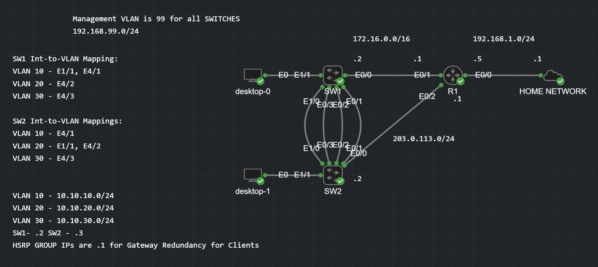

## Configuring Devices for Remote Management

To configure the devices with SecureCRT, I first needed to configure IP addresses on the devices within CML. I configured each device with the appropriate IP address based on the topology. The switches are remotely accessed via their VLAN 99 management SVIs after initial configuration. All interfaces are advertised into OSPF so the devices can be reached.

**R1:**

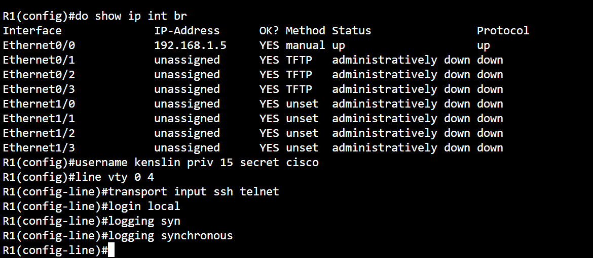

I created a local account on R1 since I was issuing the `login local` command for SSH/Telnet remote access. I also configured `logging synchronous` to prevent command interruptions, although remote sessions don't show console logs unless the `terminal monitor` command is issued. R1 can now be accessed via `192.168.1.5` via Telnet because SSH has not been configured.

**SecureCRT remote access to R1:**

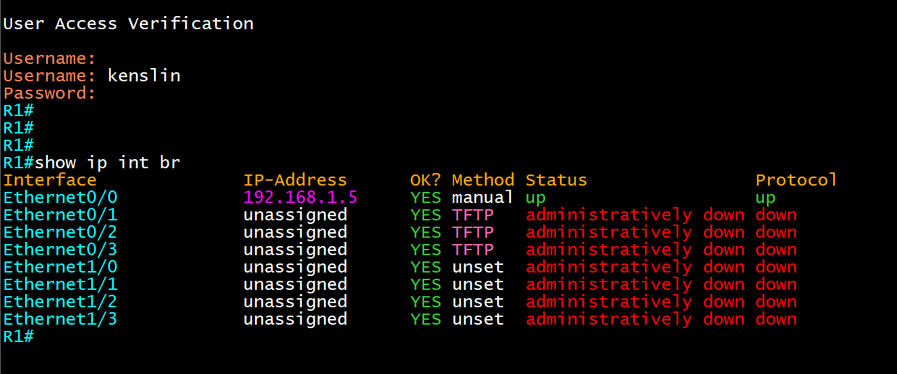

The rest of R1's interfaces have been configured with the addresses from the topology.

**R1 OSPF interfaces:**

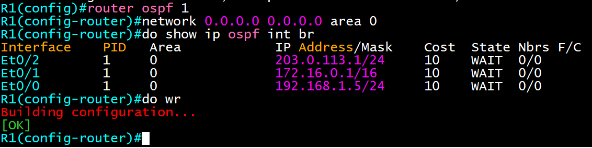

All interfaces on all devices are advertised into OSPF, which explains the `network 0.0.0.0 0.0.0.0 area 0` command for reachability throughout the network. Interfaces added in the future will be advertised into OSPF automatically. R1's default gateway is my home router, `192.168.1.1`. SW1 and SW2 both use R1 as their default gateway, and clients use SW1 and SW2 in an HSRP group as their default gateway.

**SW1:**

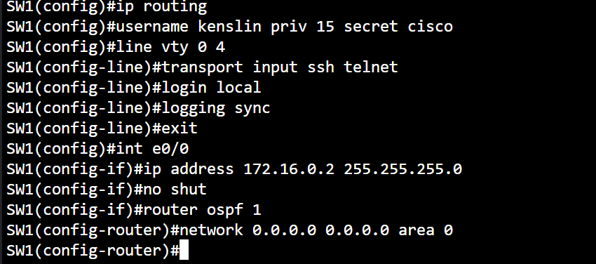

I enabled IP routing on SW1, configured it for remote access, and advertised its interfaces into OSPF. SW1 can be reached via `172.16.0.2` with Telnet. I later configured it for SSH access through its management SVI.

> **Note:** To connect remotely over my home network, the route to `172.16.0.0/16` needed to be added to my laptop's routing table in CMD with the default gateway of `192.168.1.5`.

**Issue with SW1:**

I ran into a problem with SW1 forming an OSPF neighborship with R1 through its E0/0 interface. After issuing show commands to verify everything matched, I realized I had accidentally configured a `/24` subnet instead of a `/16`. Once corrected, SW1 and R1 shared OSPF routes.

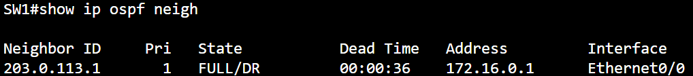

**R1's OSPF neighbor table:**

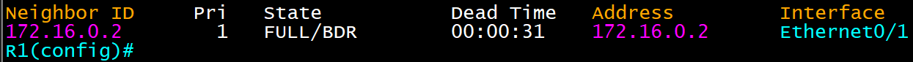

**SecureCRT remote access to SW1:**

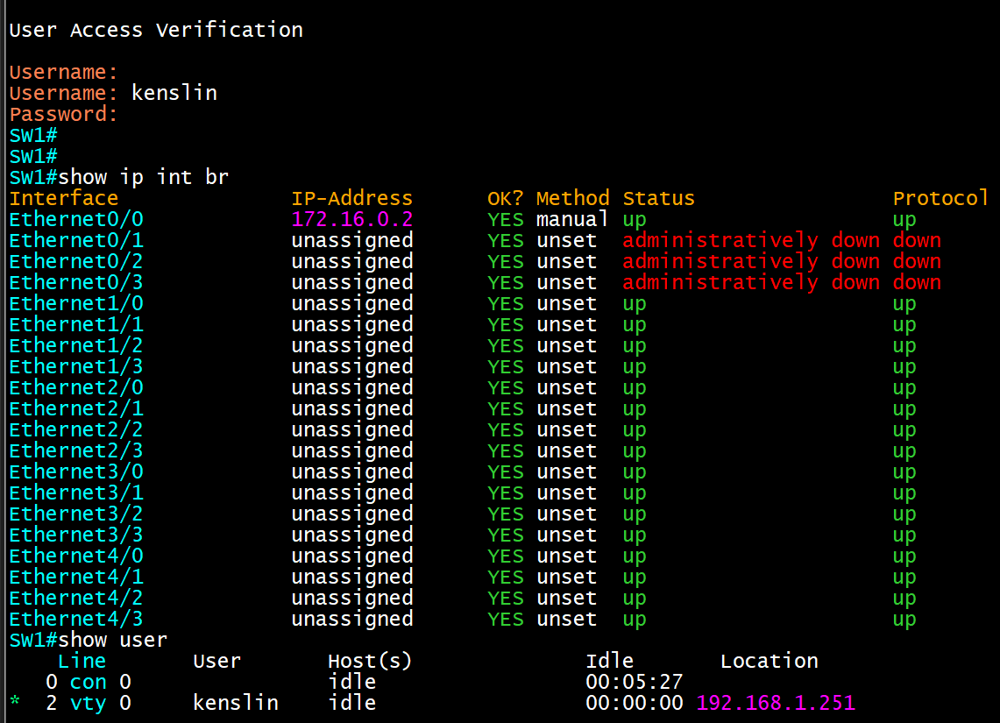

**SW2:**

SW2 was configured the same as SW1, with its IP address from the topology. I issued the `network 0.0.0.0 0.0.0.0 area 0` command to advertise all interfaces into OSPF. SW2 can be reached with Telnet at `203.0.113.2` — this was later changed to the management VLAN on both SW1 and SW2. Like SW1, I had to add a route to my laptop's routing table to reach the `203.0.113.0/24` network via `192.168.1.5`.

**SecureCRT remote access to SW2:**

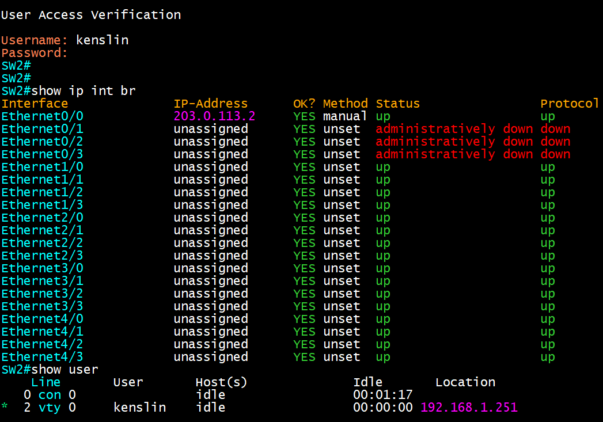

## VLANs and SVI Configuration

To create separate broadcast domains on the two switches, I created VLANs from the topology on both switches, then configured their SVIs so clients could use them as default gateways. For security, the remaining ports were placed into an unused VLAN as access ports, with DTP disabled, and then shut down completely on both switches.

**Security for unused ports on SW1:**

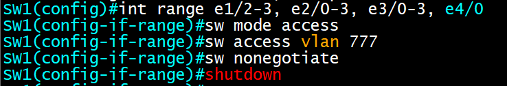

Unused switchports are commonly targeted for attacks on networks — even without physical access, unused wall jacks can be exploited. Placing unused ports into an unused VLAN prevents traffic from reaching the rest of the network. Access ports with DTP disabled ensure a trunk can't be formed by an attacker, and shutting the ports down prevents any unauthorized connectivity in a real environment.

**SW1 VLAN table:**

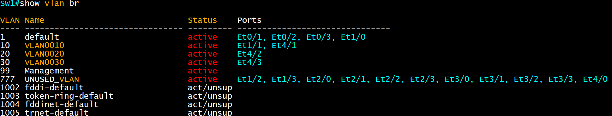

**SW2 VLAN table:**

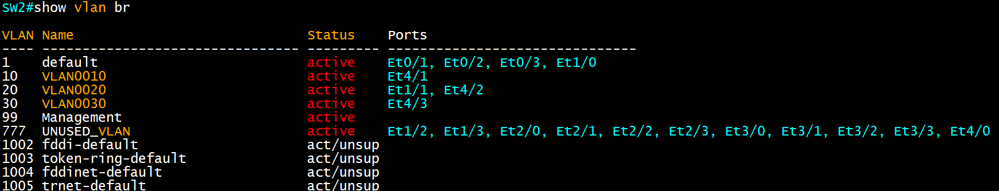

For inter-VLAN connectivity between switches, I created an SVI (Switched Virtual Interface) for each VLAN. This allows clients in separate VLANs to communicate, with the SVIs acting as default gateways. HSRP is also configured for gateway redundancy, making SW1 or SW2 the active gateway per VLAN.

**SW1 switched virtual interfaces:**

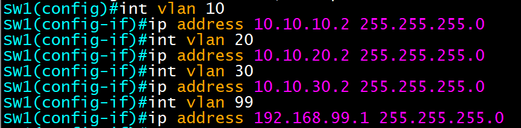

SW2 is configured identically to SW1 but uses `.3` in the last octet. The management VLAN is `.1` on SW1 and `.2` on SW2, since no HSRP group is configured for the management VLAN.

**Management VLAN SVI issue:**

The management VLAN SVI on both SW1 and SW2 came up in a down state and couldn't be reached remotely, because it had no associated ports (unlike the other VLANs). I fixed this with the `no autostate` command, which allows a VLAN interface to be enabled without any associated ports.

**Remote management issue:**

I had trouble connecting to SW1 and SW2 remotely via their management SVI addresses. Since both were advertised into OSPF, R1 had an equal-cost path to the `192.168.99.0/24` network and was load-balancing traffic between the links to SW1 and SW2 — sending traffic to the wrong switch. I fixed this by replacing the OSPF routes with static `/32` routes on R1 pointing to the correct interface for each switch.

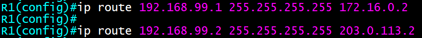

## EtherChannel Configuration

I configured an L2 EtherChannel between SW1 and SW2 for redundancy. A benefit of EtherChannel is that it appears as a single interface to Spanning Tree Protocol. The port-channel between the switches is configured as a trunk, allowing VLANs 10, 20, 30, and 99 to traverse.

**SW1 port-channel trunk configuration:**

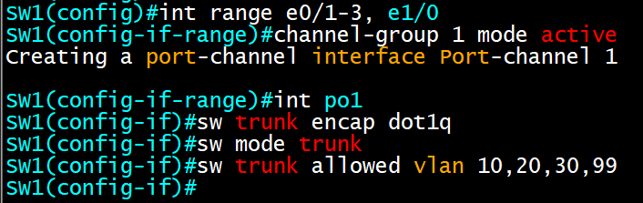

SW2 is configured identically to SW1, and a LACP EtherChannel is formed between them.

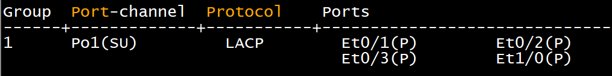

## HSRP Configuration Per-VLAN

I configured HSRP between SW1 and SW2 for gateway redundancy on each VLAN. VLANs 10 and 20 use SW1, and VLAN 30 uses SW2, as their default virtual gateways to help balance load across VLANs.

**SW1 HSRP configuration:**

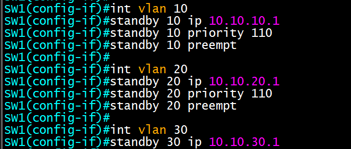

VLANs 10 and 20 are set to a higher priority than the default of 100, with preemption enabled, so SW1 becomes the active virtual gateway for those VLANs. Unlike VRRP, HSRP does not preempt the active router by default.

**SW2 HSRP configuration:**

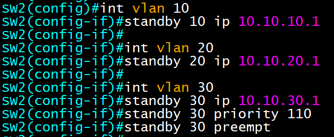

## DHCP Snooping Configuration

DHCP snooping is configured on switches to prevent rogue DHCP servers from handing out incorrect DHCP information. It builds an IP-to-MAC address table based on DHCP messages passing through the switch. Ports are untrusted by default and only accept DHCP client messages — DHCP server messages are dropped. It's configured on a per-VLAN basis.

**DHCP snooping on SW1:**

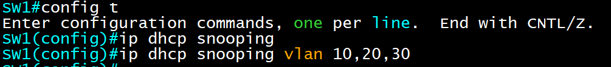

SW2 is configured identically to SW1. Only two commands are needed here — the DHCP server lives on R1, which connects to SW1 and SW2 via routed ports that can't be configured as trusted. No ports within VLANs 10, 20, or 30 should be sending DHCP server messages. I configured the port-channel between SW1 and SW2 as trusted for DHCP snooping in case the link between R1 and SW2 goes down.

### DHCP Pool Configuration

DHCP is configured on R1 to provide addresses to clients, with DHCP relay agents configured on the VLAN 10, 20, and 30 SVIs pointing to R1. I also excluded IP addresses already in use. Since DHCP snooping is configured, leases populate the DHCP snooping binding table, which is also used later for Dynamic ARP Inspection.

**Excluded DHCP addresses:**

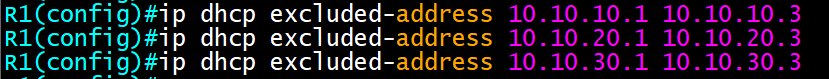

Since the VLAN subnets all use `/24`s, the usable address range for each VLAN is `10.10.X.4`–`10.10.X.254`. A smaller subnet could have been used, but a `/24` was used for simplicity.

**DHCP pools on R1:**

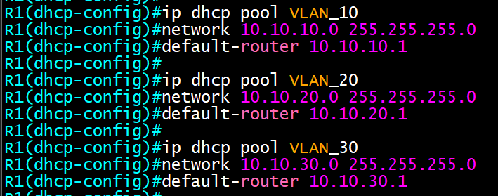

Each VLAN's pool is configured with the default gateway of its corresponding HSRP group.

**DHCP relay configuration:**

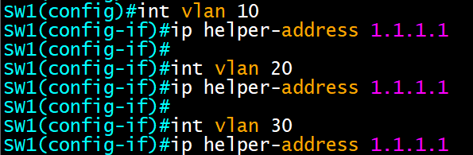

SW2 is configured identically to SW1, pointing to R1's loopback IP address.

**Desktop-0 DHCP lease:**

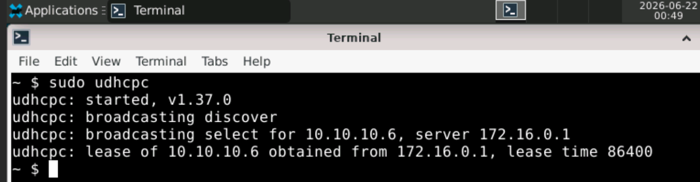

**Desktop-1 DHCP lease:**

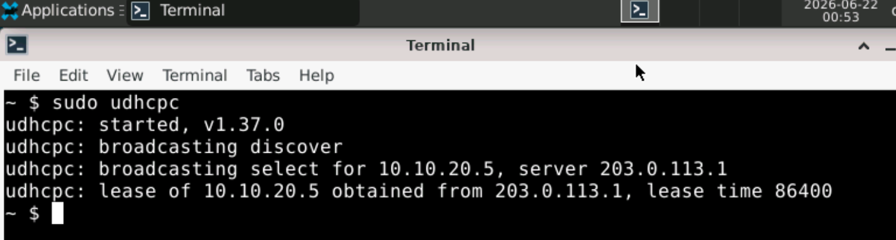

**DHCP binding table on R1:**

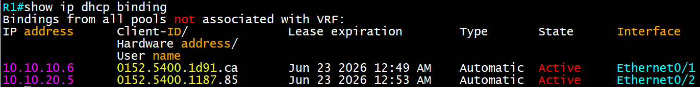

**DHCP snooping table on SW1:**

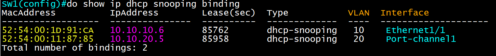

**Issue with DHCP:**

When starting the lab, clients were unable to obtain IP addresses from R1's DHCP pools, producing an "Unknown Output Interface" error in the DHCP snooping statistics and debug output. Investigating further, I found that client MAC addresses were expiring out of the switches' MAC address tables, which meant DHCP offers couldn't be relayed back since the switch no longer knew the client's associated port. Even though leased IPs showed up in R1's DHCP binding table, they stayed in the "Selecting" state and were never fully assigned. To work around this for the lab — since clients weren't sending regular traffic — I statically added the client MAC addresses to the MAC address table so they wouldn't expire.

## Dynamic ARP Inspection Configuration

Dynamic ARP Inspection (DAI) validates ARP frames to prevent ARP spoofing and poisoning attacks. It's configured alongside DHCP snooping because DAI uses the DHCP snooping binding table to verify legitimate IP-to-MAC mappings. All ports are untrusted by default in each VLAN, so I configured the LAG between SW1 and SW2 as trusted in case ARP messages need to travel between switches.

**SW1 Dynamic ARP Inspection:**

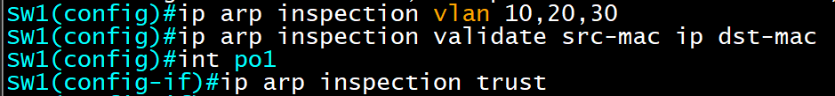

SW2 is configured identically. This enables DAI for VLANs 10, 20, and 30 and validates ARP messages using all three parameters for maximum security, with the rate limit left at its default.

## Port Security Configuration

Port security prevents MAC flooding attacks and unauthorized devices from being plugged into the switch. I used restrict mode, which drops and logs violations without err-disabling the port.

**Port security configuration:**

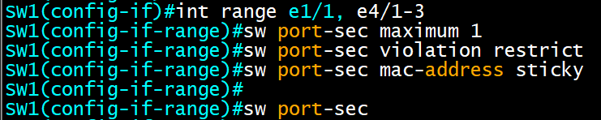

**Issue with port security:**

I initially tried to statically configure specific MAC addresses on E1/1 on SW1 and SW2, but kept getting a "port-security internal error." I switched to sticky MAC addresses instead — after removing the earlier static entries, the sticky MAC addresses were learned into the running configuration and appeared as static entries in the MAC address table.

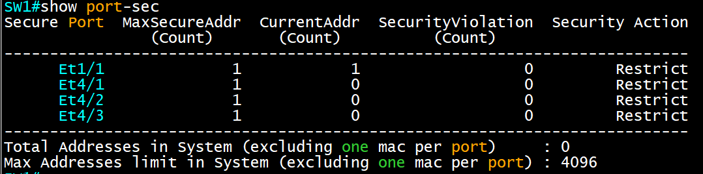
